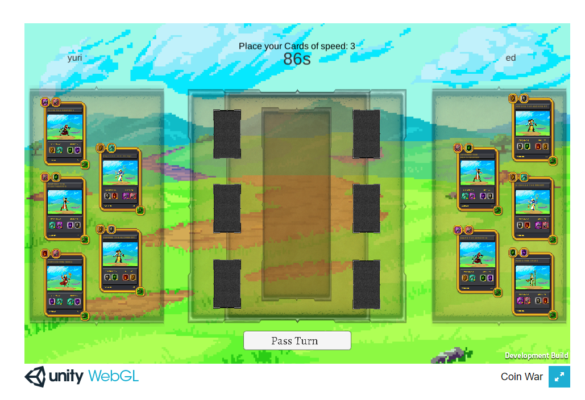

# Coin War - Online Multiplayer Cardgame

<!---Esses são exemplos. Veja https://shields.io para outras pessoas ou para personalizar este conjunto de escudos. Você pode querer incluir dependências, status do projeto e informações de licença aqui--->
Play it here :(https://yurifarion.000webhostapp.com/Coin%20War/index.html)

> Coin War is a card game, you can use predefined cards that you will receive randomly. it works almost like a rock, paper scissors game.

## 💻 Requirements

Before starting, make sure you've met the following requirements:
* Unity 2020,1,6f1
* This game uses PUN photon engine for the multiplayer connection. 

[⬆Back to the top](#SpaceBulletTime) 
